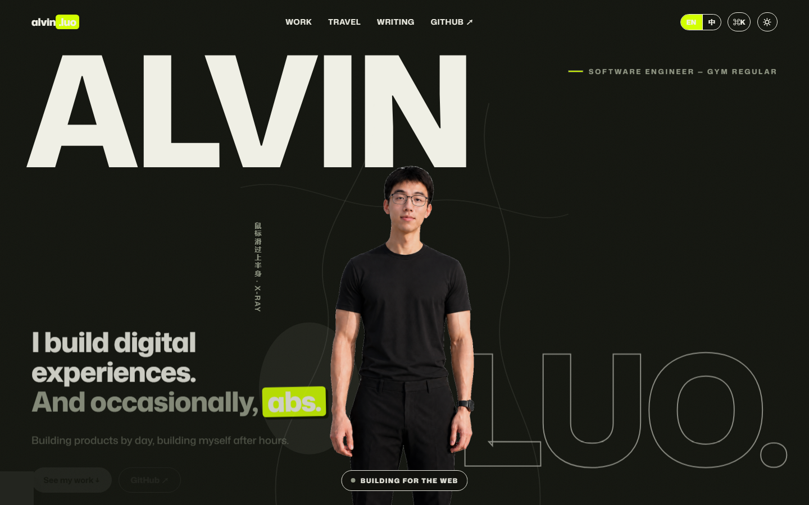
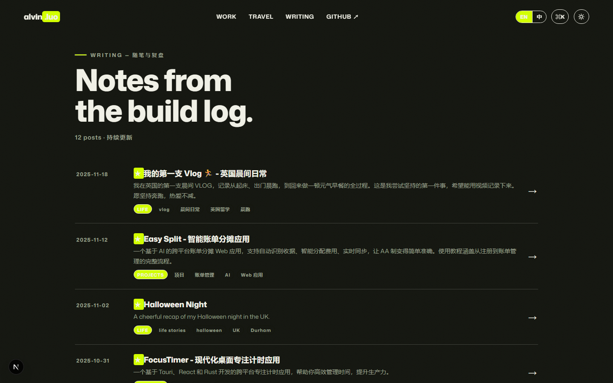

<div align="center">

# ALVIN.LUO

**Software Engineer who lifts. Building products by day, building myself after hours.**

<p>白天构建数字产品，空闲时间构建自己。</p>

<p>
  <a href="https://github.com/alvinluo-tech/personal-website"></a>
  <a href="https://nextjs.org/"></a>
  <a href="https://react.dev/"></a>
  <a href="https://www.typescriptlang.org/"></a>
  <a href="https://developer.mozilla.org/en-US/docs/Web/CSS"></a>
  <a href="https://github.com/darkroomengineering/lenis"></a>
  <a href="LICENSE"></a>
</p>

<p>
  <a href="#01--visual-preview">Preview</a> &nbsp;·&nbsp;
  <a href="#02--core-highlights">Highlights</a> &nbsp;·&nbsp;
  <a href="#03--architecture">Architecture</a> &nbsp;·&nbsp;
  <a href="#04--directory-tree">Structure</a> &nbsp;·&nbsp;
  <a href="#05--quick-start">Quick Start</a> &nbsp;·&nbsp;
  <a href="#06--customization">Customization</a> &nbsp;·&nbsp;
  <a href="#07--deployment">Deployment</a>
</p>

---

</div>

## 01 / Visual Preview

### Real-Time Interaction (Canvas Alpha Reveal)

<div align="center">
  
  <p><code>Interaction 1.0</code> — <em>Real-time hover lens sampling the athlete alpha channel beneath casual streetwear.</em></p>
</div>

<br />

### Dual-Theme Adaptive Hero

> 本预览根据您的 GitHub 主题偏好自动呈现对应色系（深色夜幕 / 浅色米白纸面）。

<div align="center">
  <picture>
    <source media="(prefers-color-scheme: dark)" srcset=".github/assets/preview-hero-dark.png">
    <source media="(prefers-color-scheme: light)" srcset=".github/assets/preview-hero-light.png">
    
  </picture>
  <p><code>Fig 1.1</code> — <em>Monumental typography with adaptive colorway across theme preferences.</em></p>
</div>

<br />

### Technical Writing & Life Archive

<div align="center">
  
  <p><code>Fig 1.2</code> — <em>Editorial reading archive with tag filtering, pinning, and static compile-time generation.</em></p>
</div>

---

## 02 / Core Highlights

### [01] Canvas X-Ray 动态人像透视 (Hero Stage)
* **基于真实 Alpha 通道的掩码合成**：直接读取训练照的高清不透明像素，无需几何图形模拟身形。光标扫过身体（胸、肩、腹、腰）时实时渲染羽化透镜，展现自律健魄。
* **状态联动与容差处理**：底部状态在 `BUILDING FOR THE WEB` 与 `BUILDING MYSELF` 之间平滑切换；内置面部自适应排除区与轮廓外扩缓冲防断触。
* **跨设备体验**：移动触屏端自动降级为点击/触控反馈策略，兼顾性能与探索趣味。

### [02] Editorial & Brutalist 杂志排版系统
* **视觉语言**：致敬 F1 车手 **Lando Norris** 官网与现代独立出版物风格。
* **三元色设计基调**：米白纸面（`--paper: #f8f8f3`）、浓重墨色（`--ink: #101400`）与高对比荧光绿（`--lime: #d2ff00`），辅以极微弱的 SVG 纸张噪点纹理。
* **破格版式排版**：本地自托管 GitHub 开源字体 `Mona Sans`，结合实心文字与描边轮廓的滚动视差，塑造鲜明的视觉重量。

### [03] Bento Grid 模块化生活切面
* **多源容灾 GitHub 贡献图**：按顺序轮询 `ghchart` / `activity-graph` / `readme-stats`，遇阻自动降级为备用图源与跳转引导，保障全球可达。
* **硬核三大项指标**：卧推 100KG · 深蹲 140KG · 硬拉 180KG，具象化展示工程师的体能自律。
* **生活切面集成**：集成 Currently 近况追踪与随身音乐状态卡片，让主页保持活态。

### [04] 钉住式横向旅行胶片 (Travel Section)
* **1:1 视口横移映射**：桌面端结合视口钉住（Pinned Scroll）驱动胶片横移，超长内容平滑滑过；移动端自动解绑并退化为原生横向滚动条。
* **护照印章与归档**：明信片比例照片排布、国家分组章节卡，以及独立的 `/travel` 完整足迹筛选页。

### [05] Zero-Bloat 原生纯 CSS 架构
* **零运行时开销**：摒弃重型 UI 库与 Tailwind 依赖，全站依托现代 CSS 变量、Clamp 响应式计算与微动效实现，体积轻量，首屏瞬开。
* **Lenis 惯性物理平滑滚动**：提供丝滑跟手的页面滑动体验，自动遵循 `prefers-reduced-motion` 无障碍降级规范。
* **轻量双语与防闪主题**：
  * 支持 **EN / ZH** 双语即时切换，无集中语言包加载开销。
  * 内联自执行脚本预解析偏好，彻底消除深浅色切换时的白屏闪烁。
* **极客命令面板**：全局监听 `⌘K` / `Ctrl+K`，支持页面级与锚点级的快速模糊跳转。

---

## 03 / Architecture

| 领域 | 技术选型 | 作用与考量 |
| :--- | :--- | :--- |
| **应用底座** | [Next.js 16 (App Router)](https://nextjs.org/) + [React 19](https://react.dev/) | 现代全栈架构，原生支持 Turbopack 极速热重载 |
| **类型规范** | [TypeScript 7](https://www.typescriptlang.org/) | 严苛类型定义，数据源与组件 Props 全面类型安全 |
| **样式工程** | **Vanilla CSS** (CSS Variables) | 纯原生设计系统，无任何外部 CSS 编译与运行时损耗 |
| **西文字体** | [Mona Sans](https://github.com/github/mona-sans) | 由 `next/font` 本地自托管，无外部请求，零布局抖动 (CLS) |
| **动效引擎** | [Lenis 1.3](https://github.com/darkroomengineering/lenis) | 高性能惯性平滑滚动底座 |
| **内容解析** | [gray-matter](https://github.com/jonschlinkert/gray-matter) + [marked](https://github.com/markedjs/marked) | 构建期离线静态编译 Markdown 文章至 HTML |
| **交付形态** | `output: "export"` (纯静态导出) | 零服务依赖，支持全静态化托管与 CDN 秒级分发 |

---

## 04 / Directory Tree

```text
personal-website/
├── app/
│   ├── blog/                 # 博客模块：列表与动态文章路由 [slug]
│   ├── now/                  # /now 状态页面（灵感来自 nownownow.com）
│   ├── travel/               # /travel 全部旅行足迹与国家归档页
│   ├── globals.css           # 全局设计系统 Token、排版与核心动效规范
│   ├── layout.tsx            # 根布局：字体注入、主题防闪、全局导航与命令面板
│   └── page.tsx              # 首页主装配：Hero + 跑马灯 + 项目集 + Bento + 旅行胶片
├── components/
│   ├── HeroStage.tsx         # 核心交互：Canvas 双人像透视引擎（含所有调校参数）
│   ├── Projects.tsx          # 精选作品集面板（错落式排布与响应式卡片）
│   ├── GitHubTile.tsx        # GitHub 热力图多图源容灾卡片
│   ├── Travel.tsx            # 钉住式旅行胶片组件
│   ├── Nav.tsx               # 动态毛玻璃悬浮导航条
│   ├── Palette.tsx           # ⌘K 全局极客快捷搜索面板
│   └── i18n.tsx              # 轻量双语 Context 与行内 <T> 转换组件
├── config/
│   └── site.ts               # 站点核心配置文件（个人信息、项目列表、社交链接）
├── content/
│   └── blog/                 # 本地 Markdown 文章仓库（随笔、复盘、技术长文）
├── data/
│   └── trips.ts              # 旅行足迹数据源（城市、国家、日期与感悟）
└── public/
    ├── photos/               # 核心素材：穿衣照片与训练状态抠图照片
    └── travel/               # 旅行明信片照片资源
```

---

## 05 / Quick Start

### 环境依赖
* [Node.js](https://nodejs.org/) >= 18.17.0
* npm / pnpm / yarn

### 本地启动

```bash
# 1. 克隆本仓库
git clone https://github.com/alvinluo-tech/personal-website.git
cd personal-website

# 2. 安装依赖包
npm install

# 3. 启动本地开发服务
npm run dev
```

浏览器打开 [http://localhost:3000](http://localhost:3000) 即可实时预览并支持热重载。

### 生产环境静态打包

```bash
npm run build
```
打包成功后，纯静态生产资源将输出至根目录的 `out/` 文件夹中。

---

## 06 / Customization

要将本项目个性化为自己的站点，主要维护以下几处配置：

| 模块 | 文件位置 | 配置说明 |
| :--- | :--- | :--- |
| **基础信息** | [`config/site.ts`](config/site.ts) | 填写 GitHub 用户名、联系邮箱、社交主页 |
| **精选项目** | [`config/site.ts`](config/site.ts) | 替换 `PROJECTS` 数组中的真实开源项目、链接与标签 |
| **人像素材** | [`public/photos/`](public/photos/) | 放入透明通道 PNG（`hero-clothed.png` 与 `hero-training.png`） |
| **透镜调参** | [`components/HeroStage.tsx`](components/HeroStage.tsx) | 调整 `CONFIG`：透镜半径 `lensR`、平滑系数 `posEase`、面部排除区等 |
| **旅行足迹** | [`data/trips.ts`](data/trips.ts) | 添加/修改去过的国家城市、年份与短评；图片放入 `public/travel/` |
| **技术随笔** | [`content/blog/`](content/blog/) | 直接放置 `.md` 文件，头部带有标准 Frontmatter 元数据即可自动建页 |
| **设计系统** | [`app/globals.css`](app/globals.css) | 顶部 `:root` 调整纸面底色、墨色对比度与荧光绿强调色 |

<details>
<summary><b>▸ 深入查看：HeroStage 透镜算法与调优参数手册</b></summary>

在 [`components/HeroStage.tsx`](components/HeroStage.tsx) 顶部的 `CONFIG` 常量中，你可以精细调整 Canvas 透镜物理手感：

```typescript
const CONFIG = {
  lensR: 0.18,        // 透镜相对图片宽度的半径（数值越大，透视圈越大）
  lensMinPx: 70,      // 透镜最小绝对像素半径（防止在小屏过小）
  posEase: 0.16,      // 透镜跟随光标的阻尼缓动（越小越柔软，越大越即时）
  intensityEase: 0.1, // 透镜显隐淡入淡出速度
  bodyDilate: 16,     // 轮廓外扩像素（离开身体边缘后的容差缓冲，防闪烁）
  face: {             // 面部排除椭圆区（归一化坐标），悬停脸部自动隐退透视
    cx: 0.5, cy: 0.185, rx: 0.115, ry: 0.125
  },
};
```
</details>

---

## 07 / Deployment

由于项目配置为 `output: "export"`，构建生成的是**零服务器运行开销的纯静态页面**。

### 方案 A：Vercel 部署 (推荐)
1. 将仓库推送到 GitHub。
2. 登录 [Vercel](https://vercel.com/new) 点击 **Import** 导入该仓库。
3. Framework Preset 选择 **Next.js**，直接点击 **Deploy**。
4. 每次向 `main` 分支提交即可触发全自动构建发布。

### 方案 B：GitHub Pages 部署
仓库内已包含自动化工作流 [`.github/workflows/deploy.yml`](.github/workflows/deploy.yml)：
1. 代码推送后，进入 GitHub 仓库 **Settings → Pages**。
2. 在 **Build and deployment → Source** 中勾选 **GitHub Actions**。
3. **子路径提示**：若部署在项目二级路径（`https://<user>.github.io/<repo>/`），构建时注入 `basePath`：
   ```bash
   NEXT_PUBLIC_BASE_PATH=/<仓库名> npm run build
   ```
   若绑定了顶级独立域名，则无需设置任何环境变量。

<details>
<summary><b>▸ 深入查看：Nginx 独立私有服务器静态配置参考</b></summary>

若使用自有 VPS 或 Nginx 托管静态产物 `out/`：

```nginx
server {
    listen 80;
    server_name yourdomain.com;
    root /var/www/personal-website/out;
    index index.html;

    location / {
        try_files $uri $uri.html $uri/ /index.html;
    }

    # 静态资产长效缓存
    location /_next/static/ {
        expires 1y;
        add_header Cache-Control "public, max-age=31536000, immutable";
    }
}
```
</details>

---

## 08 / Design Principles

> *"Good design is as little design as possible, but with personality that cuts through the noise."*

1. **多维真实的工程师特质**：代码不是程序员唯一的表达载体。将技术构建、体能自律、旅行足迹与深度思考有机结合，传递更加立体立体的个人形象。
2. **克制而有张力的交互**：拒绝千篇一律的模板大头照，通过物理探索感的 Canvas Alpha 透视，在首屏第一秒建立探索欲与高级感。
3. **内容导向的阅读沉浸**：精调字重、行距与版芯宽度，使长篇复盘或短篇技术随笔均具备杂志级的静谧阅读质感。

---

## 09 / License

本项目基于 [MIT License](LICENSE) 许可协议开源。

<div align="center">
  <sub>Designed & Developed by <a href="https://github.com/alvinluo-tech">Alvin Luo</a>.</sub>
</div>
